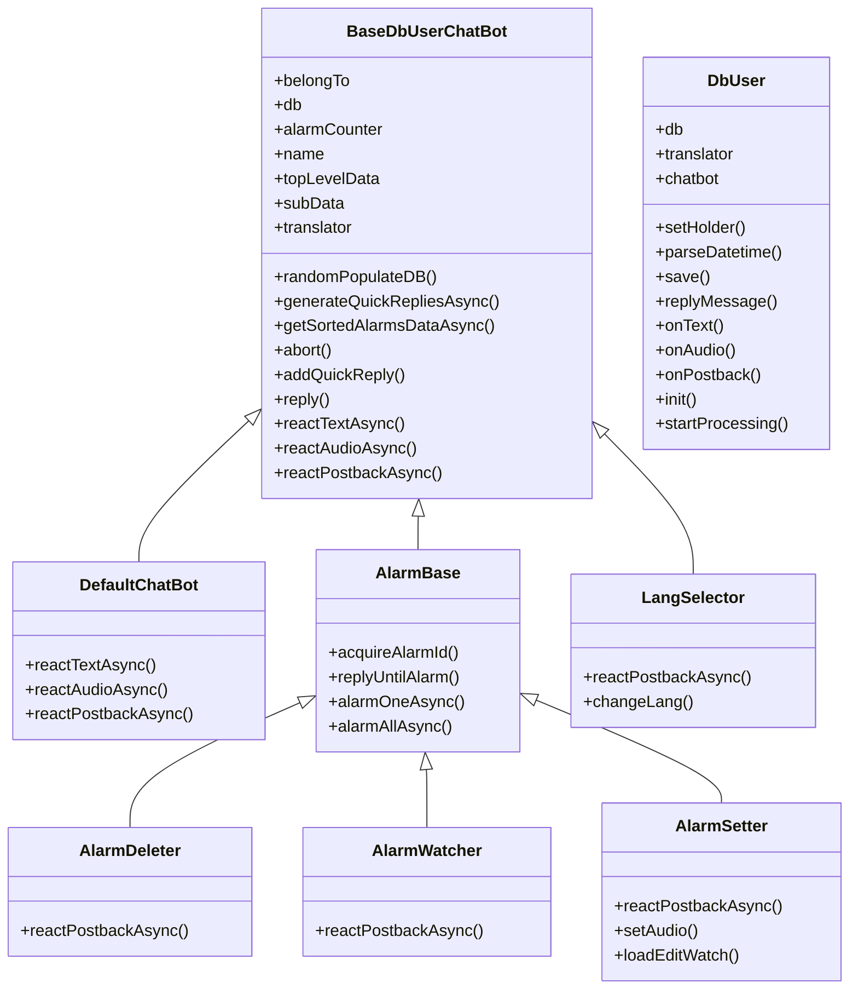
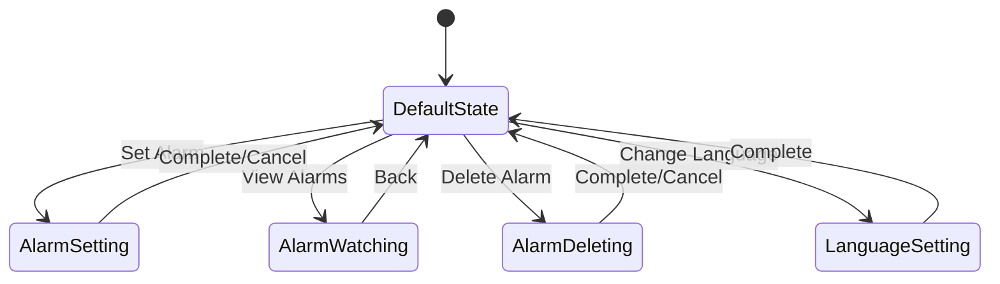
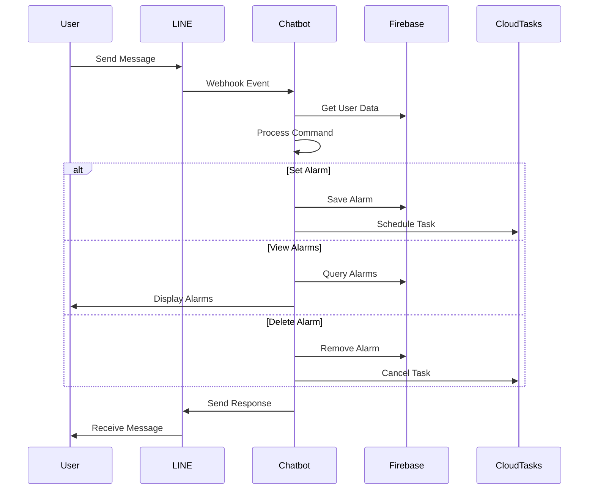

# LINE Chatbot - Voice Memo Alarm

A new way to send voice reminders through LINE. Want to remind someone something? Start with LINE.

Your voice message in LINE can be directly broadcasted to the speaker, which can be heard easily. It comes with alarm feature, so your voice message will be automatically broadcasted at the right time. Note that, the alarm is customizable voice message... Now that is revolutionary!

> Mobile-only: Some features are not available on LINE desktop app

## Tech Stack

### Key Technologies
- **Backend**: Node.js, Firebase Cloud Functions
- **Database**: Firestore (NoSQL)
- **Messaging**: LINE Messaging API
- **Cloud Services**: Google Cloud Tasks, Firebase Storage
- **Architecture**: Serverless, Event-driven
- **State Management**: Custom State Machine Implementation
- **UI/UX**: LINE Flex Messages, Rich Menu

### Technical Implementation
The integration between LINE and Firebase was achieved through:

1. **Webhook Architecture**
   - LINE events trigger Firebase functions
   - Real-time processing of user interactions
   - Seamless state transitions

2. **Message Templates**
   - Reusable components for common interactions
   - Consistent user experience
   - Easy maintenance and updates

3. **State Management**
   - Custom state machine implementation
   - Context-aware responses
   - Error handling and recovery

## Table of Contents
1. [System Architecture](#system-architecture)
2. [Project Structure](#project-structure)
3. [User Interface](#user-interface)
4. [Tutorials](#tutorials)

## System Architecture

### Class Diagram

### State Machine

### Activity Flows

## Project Structure

### Serverless Backend
The backend is built on Firebase for its reliability and scalability. Key features include:
- Real-time database with Firestore
- Serverless functions for handling LINE events
- Cloud Tasks for scheduling alarms

### API Integration
- LINE Messaging API for user interaction
- Firebase for backend services
- Cloud Tasks for scheduling

## User Interface

### Menu

### Floating Button

 

 

 

### Alarm Info Display

 

 

### Terminology
| |||
|:--------:|:--------:|:--------:|
|Alarm Watcher|Alarm Deleter|Task Manager|

## Tutorials
> *there are many* ► *buttons below, press them to watch tutorial video*

#### Language Selection
|          |**Procedures**|
|:--------:|:-----------------    |
|| 1. type in "lang" |
|| 2. navigate floating button |
|*how to...*| 

select language

  

|

#### Voice Alarm Setup
|          |**Procedures**|
|:--------:|:-----------------    |
|| 1. record voice message to start |
|| 2. pick a datetime for your voice alarm |
|| 3. received details about the alarm you just set|
|*how to...*| 

record

  

|

#### Viewing Alarms
##### After Recording
||**Procedures**|
|:-:|:--------------------            |
||navigate floating button |
|*how to...*|

view

  

 |

##### Using AlarmWatcher
||**Procedures**|
|:-:|:--------------------            |
||navigate floating button |
|*how to...*|

view all

  

 |
|*how to...*|

view single

  

|

#### Managing Alarms
||**Procedures**|
|:--:|:--------------------            |
||1. navigate floating button |
||2. <li> press "Edit" to reassign timer for the voice alarm </li> <li>press "View" to listen to recorded voice alarm </li>|
|*how to...*|

reconfigure

  

 |

#### Deleting Alarms
##### After Recording
||**Procedures**|
|:--:|:----------------- |
||press "Cancel" just after recording voice alarm <li>delete only that particular voice message you just recorded</li> |
|*how to...*| 

cancel

    

 |

##### Using AlarmDeleter
||**Procedures**|
|:---|:----------------- |
||press "Delete Alarms" icon on Richmenu <li> delete any alarms of your choice </li><li> delete all alarms  </li> |
|*how to...*| 

delete

  

 |
|*how to...*| 

exit

   

 |
